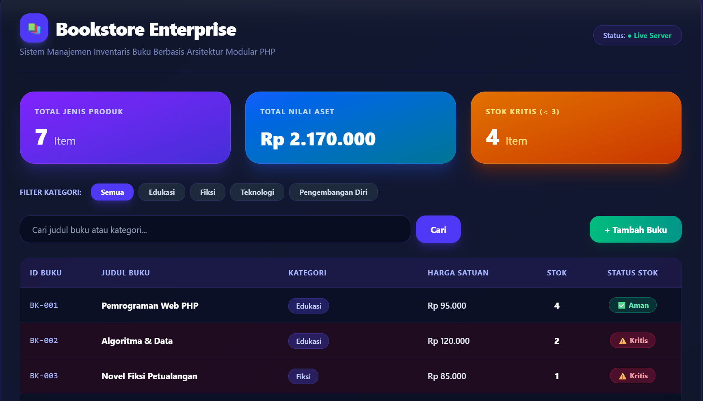

# Bookstore Enterprise | Product Information System

## 1. Deskripsi & Latar Belakang Sistem

Sistem informasi berbasis web ini dikembangkan untuk mengotomatisasi pencatatan inventaris, memantau ketersediaan barang, serta menghitung nilai total aset produk pada usaha inventaris buku. Pembangunan perangkat lunak ini menerapkan arsitektur modular berbasis PHP *native* dengan memisahkan sumber daya, fungsi komputasi, dan tata letak antarmuka agar kode lebih bersih serta mudah dikembangkan.

---

## 2. Pemetaan Arsitektur & Analisis Berkas Modular

Penerapan struktur direktori program ini dirancang secara terisolasi ke dalam beberapa bagian utama guna memenuhi standar pemisahan tugas (*Separation of Concerns*):

### A. Data Layer (`products.php`)
* **Peran Utama:** Berfungsi sebagai modul penyimpanan memori lokal yang memuat keseluruhan data produk awal.
* **Detail Implementasi:**
  1. **Struktur Multidimensional Array:** Memanfaatkan larik bersarang (*nested array*) untuk menampung seluruh entri komoditas di dalam satu variabel tunggal.
  2. **Atribut Rekaman Data:** Setiap elemen spesifik yang mencakup:
     * `id`: Kode identifikasi unik atau *Stock Keeping Unit* (SKU).
     * `nama`: Nama komoditas produk buku.
     * `kategori`: Klasifikasi kelompok literatur (misal: Teknologi, Fiksi, Bisnis).
     * `harga`: Nilai satuan mata uang dalam bentuk numerik.
     * `stok`: Jumlah ketersediaan fisik barang di gudang.

### B. Controller & Logic Layer (`functions.php`)
* **Peran Utama:** Pusat pengendali logika bisnis dan pemrosesan data transaksional sistem.
* **Detail Implementasi:**
  1. **Fungsi Kalkulasi Statistik Aset:** Melakukan iterasi otomatis untuk menjumlahkan total keseluruhan produk serta menghitung total nilai valuasi finansial aset gudang.
  2. **Fungsi Filter & Penyorotan Kritis (`cekStok`):** Menguji ambang batas kuantitas stok barang terhadap batas minimum tertentu, lalu memberikan tanda penyorotan otomatis apabila stok komoditas menipis (*restock*).

### C. Presentation & View Layer (`index.php` & `tambah.php`)
* **Peran Utama:** Antarmuka visual yang berinteraksi langsung dengan pengguna melalui peramban web.
* **Detail Implementasi:**
  1. **`index.php` (Dashboard Utama):** Menampilkan ringkasan statistik inventaris serta tabel rincian data komoditas lengkap dengan fitur penyorotan warna otomatis pada baris produk yang memerlukan perhatian khusus (*restock*).
  2. **`tambah.php` (Formulir Entri):** Menyediakan antarmuka masukan data terstruktur guna memudahkan penambahan inventaris buku baru ke dalam sistem.

---

## 3. Dokumentasi Antarmuka Sistem (Web Interface)

Tampilan antarmuka dirancang secara responsif menggunakan kerangka kerja CSS modern untuk memastikan keterbacaan data yang optimal:

* **Bagian Header:** Memuat judul identitas sistem informasi inventaris toko buku dengan nuansa *Cyber/Enterprise*.
* **Panel Ringkasan Statistik:** Menampilkan kotak informasi cepat yang merangkum jumlah ragam produk, total valuasi finansial aset gudang, serta jumlah item berstatus kritis.
* **Tabel Rincian Data:** Menyajikan daftar lengkap komoditas beserta status ketersediaannya dengan fitur penyorotan warna otomatis pada baris produk yang memerlukan perhatian khusus (*restock*).

---

## 🖼️ Pratinjau Tampilan Program

Berikut merupakan dokumentasi hasil tangkapan layar dari antarmuka sistem yang berjalan pada peramban web:



---

## 4. Petunjuk Instalasi & Menjalankan Program

1. Pastikan layanan modul server **Apache** pada aplikasi **XAMPP** sudah aktif.
2. Pindahkan direktori folder proyek ini ke dalam direktori penyimpanan server lokal:
   ```text
   C:\xampp\htdocs\project_buku\
